# 🦸 FinHero — Gestão Financeira Colaborativa

<div align="center">

**Uma fintech de gestão financeira onde dois usuários formam uma "dupla" e gerenciam suas finanças juntos, com gamificação e interface moderna.**

`Java 21` · `Spring Boot 3.5` · `React 19` · `TypeScript` · `PostgreSQL 16` · `JWT` · `Docker`

</div>

---

## 📋 Índice

- [Sobre o Projeto](#-sobre-o-projeto)
- [Arquitetura Geral](#️-arquitetura-geral)
- [Diagrama de Classes](#-diagrama-de-classes)
- [Modelagem do Banco de Dados](#️-modelagem-do-banco-de-dados)
- [Fluxo de Autenticação](#-fluxo-de-autenticação)
- [API Endpoints](#-api-endpoints)
- [Segurança](#-segurança)
- [Frontend](#-frontend)
- [Como Rodar](#-como-rodar)
- [Estrutura de Pastas](#-estrutura-de-pastas)
- [Testes](#-testes)
- [Docker](#-docker)
- [Tecnologias](#️-tecnologias)

---

## 📖 Sobre o Projeto

O **FinHero** é uma aplicação fullstack de gestão financeira colaborativa desenvolvida como projeto acadêmico na FIAP. O diferencial é o conceito de **"dupla"**: dois usuários se conectam via código de convite e passam a gerenciar suas finanças juntos, com gamificação para incentivar o engajamento.

### Funcionalidades

| Funcionalidade | Descrição |
|----------------|-----------|
| **Autenticação JWT** | Registro e login com tokens seguros (BCrypt + HMAC-SHA) |
| **Sistema de Duplas** | Vincule-se a outro usuário via código de convite de 8 caracteres |
| **Gestão de Transações** | Registre receitas e despesas com categorias personalizadas |
| **Categorias Automáticas** | 7 categorias padrão criadas no registro (Moradia, Alimentação, Transporte, Saúde, Educação, Lazer, Outros) |
| **Gamificação** | Sistema de XP, níveis e conquistas no frontend |
| **Dark Mode** | Tema escuro/claro com persistência em localStorage |
| **Swagger** | Documentação interativa da API em `/swagger-ui` |
| **Paginação** | Listagem de transações paginada |

### Fluxo de Uso

```
1. Usuário A se registra → recebe invite code "ABC12345"
2. Usuário A compartilha o código com Usuário B
3. Usuário B se registra e vincula via código → Dupla formada!
4. Ambos registram transações (receitas e despesas)
5. Dashboard mostra resumo financeiro + gamificação (XP, níveis, conquistas)
```

---

## 🏗️ Arquitetura Geral

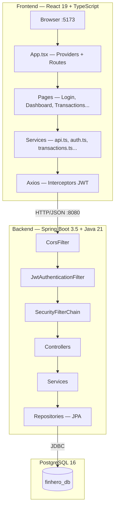

### Camadas do Backend

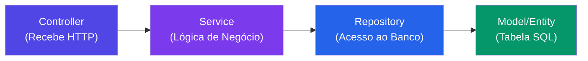

| Camada | Responsabilidade | Exemplo |
|--------|-----------------|---------|
| **Controller** | Recebe requisições HTTP, valida DTOs com `@Valid`, retorna `ResponseEntity` | `AuthController`, `TransactionController` |
| **Service** | Lógica de negócio, validações, regras, transações `@Transactional` | `AuthService`, `DuplaService` |
| **Repository** | Interface JPA — Spring Data gera SQL automaticamente | `UserRepository`, `TransactionRepository` |
| **Model** | Entidades JPA mapeadas para tabelas PostgreSQL | `User`, `Transaction`, `Dupla`, `Category` |
| **DTO** | Objetos de transferência (sem expor dados sensíveis como senha) | `RegisterDTO`, `AuthResponse` |
| **Exception** | Exceções customizadas tratadas pelo `GlobalExceptionHandler` | `EmailAlreadyExistsException` |
| **Filter** | Intercepta requisições para validar JWT antes do controller | `JwtAuthenticationFilter` |
| **Config** | Configurações do Spring (Security, CORS, Swagger) | `SecurityConfig`, `CorsConfig` |

---

## 📐 Diagrama de Classes

### Entities (Models)

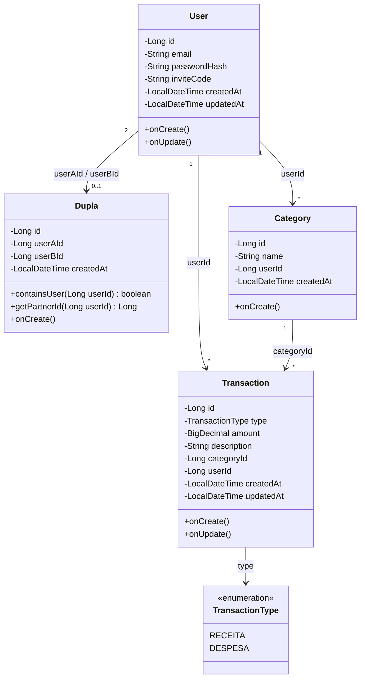

### DTOs (Data Transfer Objects)

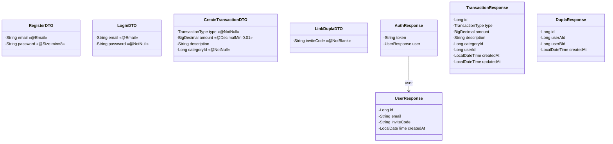

### Controllers e Services

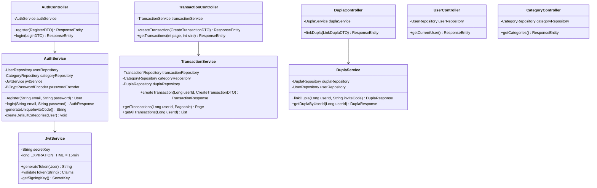

### Exceptions e Handler

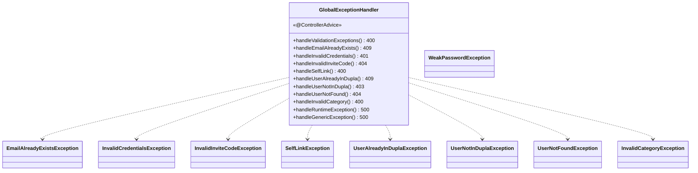

---

## 🗄️ Modelagem do Banco de Dados

### Diagrama ER (Entidade-Relacionamento)

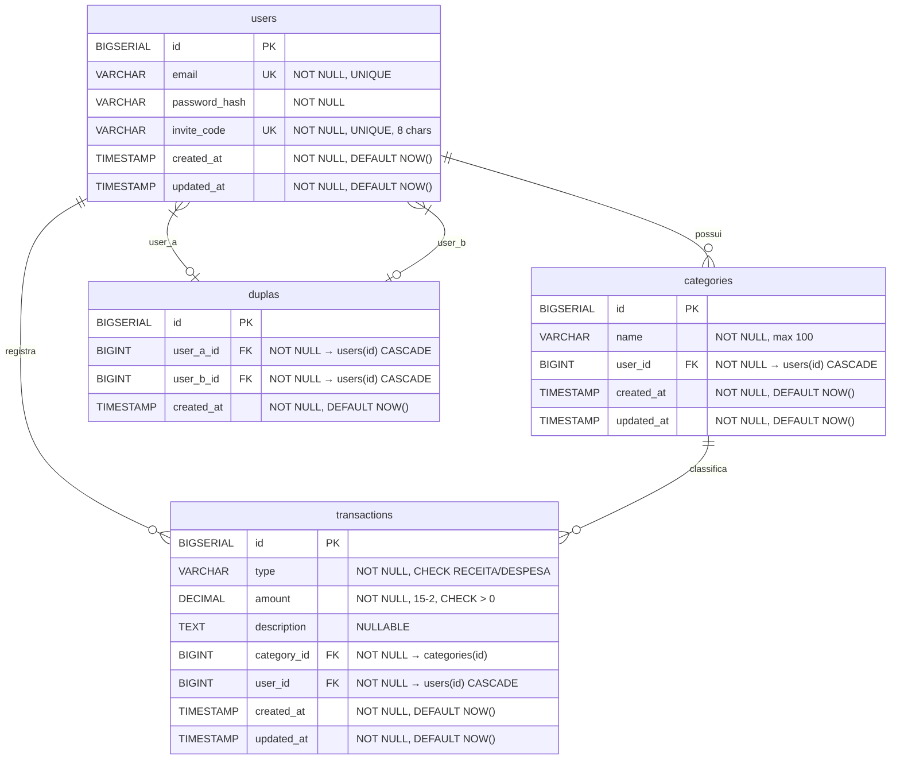

### Constraints Importantes

| Tabela | Constraint | Descrição |
|--------|-----------|-----------|
| `users` | `UNIQUE(email)` | Não permite emails duplicados |
| `users` | `UNIQUE(invite_code)` | Código de convite único |
| `duplas` | `UNIQUE(user_a_id, user_b_id)` | Impede duplas duplicadas |
| `duplas` | `CHECK(user_a_id < user_b_id)` | Garante ordenação para evitar (A,B) e (B,A) |
| `transactions` | `CHECK(type IN ('RECEITA','DESPESA'))` | Apenas tipos válidos |
| `transactions` | `CHECK(amount > 0)` | Apenas valores positivos |

### Índices

| Tabela | Índice | Colunas |
|--------|--------|---------|
| `users` | `idx_users_email` | `email` |
| `users` | `idx_users_invite_code` | `invite_code` |
| `categories` | `idx_categories_user_id` | `user_id` |
| `duplas` | `idx_duplas_user_a` | `user_a_id` |
| `duplas` | `idx_duplas_user_b` | `user_b_id` |
| `transactions` | `idx_transactions_user_id` | `user_id` |
| `transactions` | `idx_transactions_created_at` | `created_at DESC` |
| `transactions` | `idx_transactions_category_id` | `category_id` |

### Flyway Migrations

As tabelas são criadas automaticamente pelo Flyway na ordem:

| Ordem | Arquivo | Tabela |
|-------|---------|--------|
| 1 | `V001__create_users.sql` | `users` + índices email e invite_code |
| 2 | `V002__create_categories.sql` | `categories` + índice user_id |
| 3 | `V003__create_duplas.sql` | `duplas` + constraints + índices |
| 4 | `V004__create_transactions.sql` | `transactions` + checks + índices |

---

## 🔐 Fluxo de Autenticação

### Registro + Login

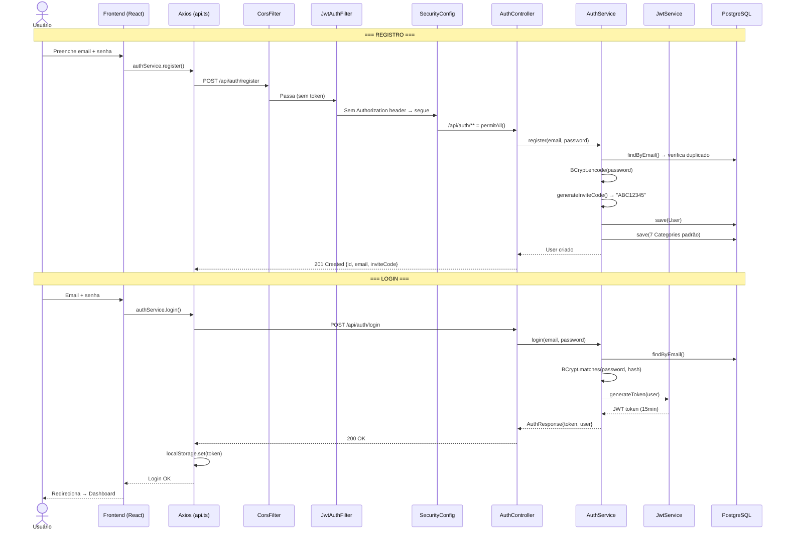

### Requisição Autenticada

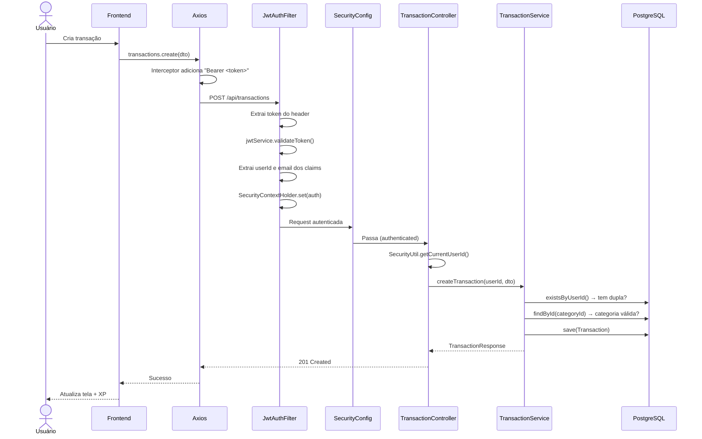

---

## 🔌 API Endpoints

### Autenticação (rotas públicas)

| Método | Endpoint | Descrição | Request Body | Response |
|--------|----------|-----------|-------------|----------|
| `POST` | `/api/auth/register` | Cadastro | `{email, password}` | `201` `{id, email, inviteCode, createdAt}` |
| `POST` | `/api/auth/login` | Login | `{email, password}` | `200` `{token, user}` |

### Usuário (autenticadas — `Authorization: Bearer <token>`)

| Método | Endpoint | Descrição | Response |
|--------|----------|-----------|----------|
| `GET` | `/api/users/me` | Dados do usuário logado | `200` `{id, email, inviteCode, createdAt}` |

### Transações (autenticadas)

| Método | Endpoint | Descrição | Body / Params | Response |
|--------|----------|-----------|---------------|----------|
| `POST` | `/api/transactions` | Criar transação | `{type, amount, categoryId, description?}` | `201` `TransactionResponse` |
| `GET` | `/api/transactions` | Listar (paginado) | `?page=0&size=20` | `200` `Page<TransactionResponse>` |

### Duplas (autenticadas)

| Método | Endpoint | Descrição | Body | Response |
|--------|----------|-----------|------|----------|
| `POST` | `/api/dupla/link` | Vincular dupla | `{inviteCode}` | `200` `{id, userAId, userBId, createdAt}` |

### Categorias (autenticadas)

| Método | Endpoint | Descrição | Response |
|--------|----------|-----------|----------|
| `GET` | `/api/categories` | Listar categorias do usuário | `200` `Category[]` |

### Documentação

| URL | Descrição |
|-----|-----------|
| `/swagger-ui/index.html` | Swagger UI interativo |
| `/v3/api-docs` | OpenAPI JSON spec |

### Códigos de erro

| Status | Exceção | Quando |
|--------|---------|--------|
| `400` | `MethodArgumentNotValidException` | DTO com campos inválidos |
| `400` | `SelfLinkException` | Tentar vincular-se a si mesmo |
| `400` | `InvalidCategoryException` | Categoria inválida ou de outro usuário |
| `401` | `InvalidCredentialsException` | Email ou senha incorretos |
| `403` | `UserNotInDuplaException` | Criar transação sem estar em dupla |
| `404` | `UserNotFoundException` | Usuário não encontrado |
| `404` | `InvalidInviteCodeException` | Código de convite inválido |
| `409` | `EmailAlreadyExistsException` | Email já cadastrado |
| `409` | `UserAlreadyInDuplaException` | Usuário já está em uma dupla |
| `500` | `RuntimeException` / `Exception` | Erro interno |

---

## 🔒 Segurança

### Cadeia de Filtros

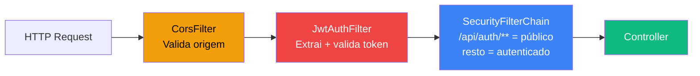

### Detalhes

| Aspecto | Implementação |
|---------|---------------|
| **Hash de senha** | `BCryptPasswordEncoder` com 10 rounds (salt automático) |
| **JWT** | HMAC-SHA com chave de 256 bits, expiração de 15 minutos |
| **Claims do JWT** | `subject`=email, `userId`=id, `email`=email, `iat`, `exp` |
| **Sessão** | Stateless (sem cookies de sessão, sem estado no servidor) |
| **CSRF** | Desabilitado (API REST stateless) |
| **CORS** | Permite todas as origens (`allowedOriginPattern = *`) |
| **Rotas públicas** | `/api/auth/**`, `/swagger-ui/**`, `/v3/api-docs/**` |
| **Token no frontend** | Armazenado no `localStorage`, injetado via Axios interceptor |
| **Token expirado** | Axios interceptor detecta 401, limpa storage, redireciona para `/login` |

---

## ⚛️ Frontend

### Arquitetura de Providers

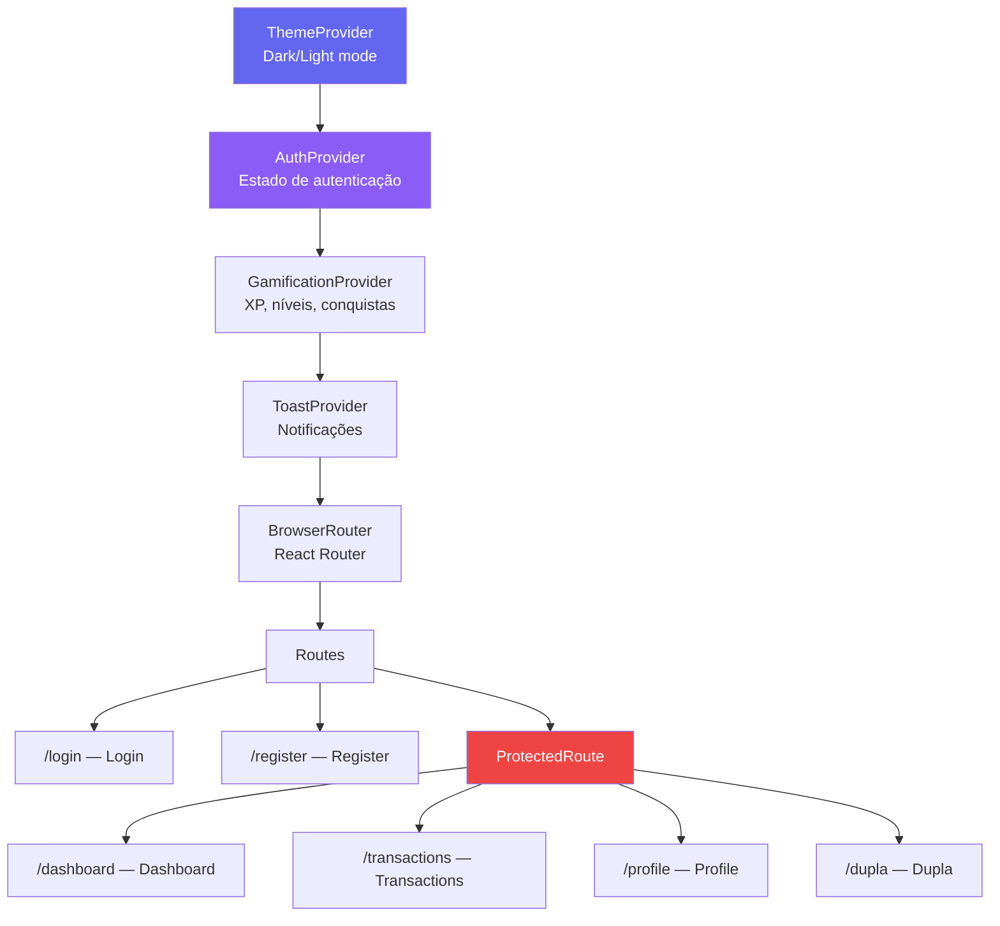

### Contexts

| Context | Responsabilidade | Persistência |
|---------|-----------------|-------------|
| `AuthContext` | Login, registro, logout, estado do usuário, `isAuthenticated` | `localStorage` (token + user) |
| `ThemeContext` | Dark/light mode, toggle | `localStorage` |
| `GamificationContext` | XP, níveis, conquistas, desbloqueios | `localStorage` |
| `ToastContext` | Notificações de sucesso/erro na tela | Memória (state) |

### Services (camada HTTP)

| Service | Arquivo | Endpoints |
|---------|---------|-----------|
| API Base | `api.ts` | Axios instance + interceptors (token inject + 401 redirect) |
| Auth | `auth.ts` | `register()`, `login()`, `logout()`, `getCurrentUser()` |
| Transactions | `transactions.ts` | `create()`, `getAll()` |
| Dupla | `dupla.ts` | `link()`, `get()` |
| Categories | `categories.ts` | `getAll()` |

### Types (TypeScript)

```typescript
interface User { id, email, inviteCode, createdAt }
interface AuthResponse { token, user }
interface Transaction { id, type, amount, description, categoryId, userId, createdAt, updatedAt }
interface Category { id, name, userId, createdAt }
interface Dupla { id, userAId, userBId, createdAt }
type TransactionType = 'RECEITA' | 'DESPESA'
interface PaginatedResponse<T> { content, totalElements, totalPages, size, number }
interface ApiError { error, message? }
```

---

## 🚀 Como Rodar

### Pré-requisitos

- **Java 21** (Temurin)
- **Maven 3.9+**
- **Node.js 18+** e **npm 9+**
- **Docker** e **Docker Compose**

### 1. Subir o banco de dados

```bash
docker-compose up -d
```

> PostgreSQL 16 na porta `5432` — database: `finhero_db`, user: `postgres`, senha: `postgres`

### 2. Rodar o backend

```bash
cd finhero
./mvnw spring-boot:run
```

> Backend em `http://localhost:8080` — Flyway cria as tabelas automaticamente

### 3. Rodar o frontend

```bash
cd frontend-finhero
npm install
npm run dev
```

> Frontend em `http://localhost:5173`

---

## 📁 Estrutura de Pastas

```
FinHero---Fiap/
├── finhero/                              # ═══ BACKEND ═══
│   ├── src/main/java/com/finhero/finhero/
│   │   ├── FinheroApplication.java       # Main class (Spring Boot entry point)
│   │   ├── config/
│   │   │   ├── SecurityConfig.java       # SecurityFilterChain, rotas públicas/protegidas
│   │   │   ├── CorsConfig.java           # CORS — permite requisições do frontend
│   │   │   ├── OpenApiConfig.java        # Swagger/OpenAPI config
│   │   │   └── GlobalExceptionHandler.java # @ControllerAdvice — tratamento de erros
│   │   ├── controller/
│   │   │   ├── AuthController.java       # POST /api/auth/register, /login
│   │   │   ├── TransactionController.java # POST/GET /api/transactions
│   │   │   ├── DuplaController.java      # POST /api/dupla/link
│   │   │   ├── UserController.java       # GET /api/users/me
│   │   │   └── CategoryController.java   # GET /api/categories
│   │   ├── dto/
│   │   │   ├── RegisterDTO.java          # {email @Email, password @Size(min=8)}
│   │   │   ├── LoginDTO.java             # {email, password}
│   │   │   ├── CreateTransactionDTO.java # {type, amount, categoryId, description?}
│   │   │   ├── LinkDuplaDTO.java         # {inviteCode @NotBlank}
│   │   │   ├── AuthResponse.java         # {token, user}
│   │   │   ├── UserResponse.java         # {id, email, inviteCode, createdAt}
│   │   │   ├── TransactionResponse.java  # {id, type, amount, ...}
│   │   │   └── DuplaResponse.java        # {id, userAId, userBId, createdAt}
│   │   ├── exception/                    # 8 exceções customizadas
│   │   │   ├── EmailAlreadyExistsException.java    # → 409
│   │   │   ├── InvalidCredentialsException.java    # → 401
│   │   │   ├── InvalidCategoryException.java       # → 400
│   │   │   ├── InvalidInviteCodeException.java     # → 404
│   │   │   ├── SelfLinkException.java              # → 400
│   │   │   ├── UserAlreadyInDuplaException.java    # → 409
│   │   │   ├── UserNotInDuplaException.java        # → 403
│   │   │   ├── UserNotFoundException.java          # → 404
│   │   │   └── WeakPasswordException.java
│   │   ├── filter/
│   │   │   └── JwtAuthenticationFilter.java  # OncePerRequestFilter — valida JWT
│   │   ├── model/
│   │   │   ├── User.java                # @Entity → tabela "users"
│   │   │   ├── Transaction.java         # @Entity → tabela "transactions"
│   │   │   ├── Dupla.java               # @Entity → tabela "duplas"
│   │   │   └── Category.java            # @Entity → tabela "categories"
│   │   ├── repository/
│   │   │   ├── UserRepository.java      # findByEmail, findByInviteCode
│   │   │   ├── TransactionRepository.java # findByUserIdOrderByCreatedAtDesc
│   │   │   ├── DuplaRepository.java     # findByUserId, existsByUserId
│   │   │   └── CategoryRepository.java  # findByUserId
│   │   ├── service/
│   │   │   ├── AuthService.java         # register, login, inviteCode, defaultCategories
│   │   │   ├── TransactionService.java  # createTransaction, getTransactions
│   │   │   ├── DuplaService.java        # linkDupla, getDuplaByUserId
│   │   │   └── JwtService.java          # generateToken, validateToken (HMAC-SHA, 15min)
│   │   └── util/
│   │       └── SecurityUtil.java        # getCurrentUserId() do SecurityContext
│   ├── src/main/resources/
│   │   ├── application.properties       # Config: DB, JWT secret, Flyway, porta 8080
│   │   ├── application-docker.properties # Profile Docker (host=postgres)
│   │   └── db/migration/               # Flyway SQL migrations
│   │       ├── V001__create_users.sql
│   │       ├── V002__create_categories.sql
│   │       ├── V003__create_duplas.sql
│   │       └── V004__create_transactions.sql
│   ├── src/test/                        # Testes unitários e integração
│   └── pom.xml                          # Dependências Maven
│
├── frontend-finhero/                    # ═══ FRONTEND ═══
│   ├── src/
│   │   ├── App.tsx                      # Providers aninhados + Routes
│   │   ├── main.tsx                     # ReactDOM.createRoot
│   │   ├── components/
│   │   │   ├── common/                  # Button, Card, Input, Modal, Loading,
│   │   │   │                            # Toast, ThemeToggle, ProtectedRoute, Layout
│   │   │   └── gamification/            # AchievementCard, AchievementUnlock, XPBar
│   │   ├── context/
│   │   │   ├── AuthContext.tsx          # Login/register/logout state + init
│   │   │   ├── ThemeContext.tsx         # Dark/light toggle + localStorage
│   │   │   ├── GamificationContext.tsx  # XP, níveis, conquistas + localStorage
│   │   │   └── ToastContext.tsx         # Notificações (success/error)
│   │   ├── pages/
│   │   │   ├── Login.tsx, Register.tsx  # Auth (rotas públicas)
│   │   │   ├── Dashboard.tsx            # Resumo financeiro + gráficos
│   │   │   ├── Transactions.tsx         # CRUD de transações
│   │   │   ├── Profile.tsx              # Dados + conquistas do usuário
│   │   │   └── Dupla.tsx                # Vincular dupla via invite code
│   │   ├── services/
│   │   │   ├── api.ts                   # Axios config + interceptors JWT
│   │   │   ├── auth.ts                  # register, login, logout, getCurrentUser
│   │   │   ├── transactions.ts          # create, getAll
│   │   │   ├── dupla.ts                 # link, get
│   │   │   └── categories.ts            # getAll
│   │   ├── hooks/useToast.ts
│   │   ├── types/index.ts              # Interfaces TypeScript (User, Transaction, etc.)
│   │   └── utils/                      # constants, formatters, validators, storage
│   ├── package.json
│   ├── vite.config.ts
│   ├── tailwind.config.js
│   └── tsconfig.json
│
├── .github/workflows/                   # CI/CD (GitHub Actions)
│   ├── main.yml                         # Build + test na main
│   ├── feature.yml                      # Build em feature branches
│   ├── deploy.yml                       # Deploy pipeline
│   └── javaReusable.yml                 # Workflow reutilizável Java
├── Dockerfile                           # Multi-stage: Maven build → JRE Alpine
├── docker-compose.yml                   # PostgreSQL 16
└── README.md
```

---

## 🧪 Testes

```bash
cd finhero
./mvnw test
```

### Cobertura

| Classe | Testes | O que cobre |
|--------|--------|-------------|
| `AuthServiceTest` | 8 | Registro, login, email duplicado, senha incorreta, normalização, inviteCode |
| `TransactionServiceTest` | 8 | Criar transação, validação dupla/categoria, paginação, listagem |
| `DuplaServiceTest` | 11 | Vincular, auto-link, duplicata, busca, containsUser, getPartnerId |
| `JwtServiceTest` | 5 | Gerar token, validar, rejeitar inválido, diferentes users |
| `AuthIntegrationTest` | 9 | Fluxo HTTP completo: register → login (201, 400, 401, 409) |
| `TransactionIntegrationTest` | 3 | Criar/listar via HTTP com JWT válido/inválido |
| **Total** | **44** | **100% aprovados** |

---

## 🐳 Docker

### Dockerfile (multi-stage build)

```dockerfile
# Stage 1: Build com Maven
FROM maven:3.9.5-eclipse-temurin-21 AS build
COPY ./finhero/pom.xml ./pom.xml
RUN mvn dependency:go-offline -B
COPY ./finhero/src ./src
RUN mvn clean package -DskipTests

# Stage 2: Runtime leve
FROM eclipse-temurin:21-jre-alpine
COPY --from=build /app/target/finhero-0.0.1-SNAPSHOT.jar app.jar
EXPOSE 8080
ENTRYPOINT ["java", "-jar", "app.jar"]
```

### Docker Compose

```bash
docker-compose up -d     # Sobe PostgreSQL 16
docker-compose down      # Para tudo
docker-compose logs -f   # Ver logs
```

---

## ⚙️ Variáveis de Ambiente

### Backend (`application.properties`)

| Variável | Valor padrão | Descrição |
|----------|-------------|-----------|
| `spring.datasource.url` | `jdbc:postgresql://localhost:5432/finhero_db` | URL do banco |
| `spring.datasource.username` | `postgres` | Usuário do banco |
| `spring.datasource.password` | `postgres` | Senha do banco |
| `jwt.secret` | (definido no arquivo) | Chave HMAC-SHA para JWT |
| `server.port` | `8080` | Porta do backend |
| `spring.flyway.enabled` | `true` | Migrations automáticas |
| `spring.jpa.hibernate.ddl-auto` | `validate` | Apenas valida (Flyway cria) |

### Frontend

| Variável | Valor padrão | Descrição |
|----------|-------------|-----------|
| `VITE_API_URL` | `http://localhost:8080/api` | URL base da API |

---

## 🛠️ Tecnologias

### Backend

| Tecnologia | Versão | Função |
|------------|--------|--------|
| Java | 21 | Linguagem |
| Spring Boot | 3.5.7 | Framework web |
| Spring Security | — | Autenticação e autorização |
| Spring Data JPA | — | ORM / acesso ao banco |
| jjwt (io.jsonwebtoken) | 0.12.3 | Geração e validação JWT |
| PostgreSQL | 16 | Banco de dados relacional |
| Flyway | — | Migrations automáticas de banco |
| Lombok | — | Reduz boilerplate (getters, setters, builders) |
| SpringDoc OpenAPI | 2.5.0 | Swagger/documentação automática da API |
| Bean Validation | — | Validação de DTOs (`@Email`, `@Size`, `@NotNull`) |

### Frontend

| Tecnologia | Versão | Função |
|------------|--------|--------|
| React | 19 | UI library |
| TypeScript | — | Tipagem estática |
| Vite | — | Build tool (HMR rápido) |
| Tailwind CSS | — | Estilização utility-first |
| Axios | — | Cliente HTTP com interceptors |
| Framer Motion | — | Animações e transições |
| React Router | — | Roteamento SPA |
| React Hook Form | — | Gerenciamento de formulários |
| Zod | — | Validação de schemas |
| Recharts | — | Gráficos e visualizações |

### Infraestrutura

| Tecnologia | Função |
|------------|--------|
| Docker | Containerização |
| Docker Compose | Orquestração local |
| GitHub Actions | CI/CD |

---

## 📝 Scripts

### Backend

```bash
./mvnw spring-boot:run          # Rodar em desenvolvimento
./mvnw test                     # Executar testes
./mvnw clean package            # Gerar JAR
./mvnw clean package -DskipTests # Gerar JAR sem testes
```

### Frontend

```bash
npm run dev       # Servidor de desenvolvimento (HMR)
npm run build     # Build de produção
npm run preview   # Preview da build
npm run lint      # ESLint
```

---

## 📄 Licença

Projeto acadêmico — FIAP 2025
